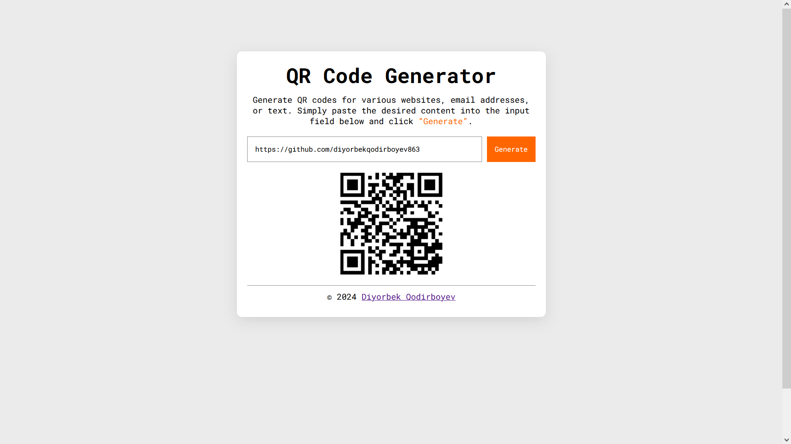

# QR Code Generator

This is a simple web-based QR Code Generator that allows you to create QR codes for URLs, email addresses, or any text. The generated QR codes can be easily scanned using any QR code reader.



## Features

- **Generate QR Codes**: Convert URLs, email addresses, or plain text into QR codes.
- **Responsive Design**: The interface is user-friendly and responsive, ensuring it works well on various devices.
- **Instant Generation**: QR codes are generated instantly when you click the "Generate" button.

## Getting Started

### Prerequisites

To run this project locally, you need a modern web browser like Chrome, Firefox, Safari, or Edge.

### Installation

1. Clone the repository:
    ```bash
    git clone https://github.com/diyorbekqodirboyev863/qr-code-generator.git
    ```
2. Navigate to the project directory:
    ```bash
    cd qr-code-generator
    ```

3. Open `index.html` in your web browser to start using the QR Code Generator.

### Usage

1. Enter the URL, email, or text you want to convert into a QR code into the input field.
2. Click the "Generate" button.
3. The QR code will be displayed below the input field.

### Example

```plaintext
Input: https://github.com
QR Code: [Displays the QR code image for https://github.com]
```

## Project Structure

- **index.html**: The main HTML file that structures the web page.
- **styles.css**: The CSS file for styling the application.
- **script.js**: The JavaScript file that handles QR code generation and UI updates.

## Technologies Used

- **HTML5**: For structuring the content.
- **CSS3**: For styling the application.
- **JavaScript**: For dynamic interactions and generating QR codes.
- **QR Server API**: To generate QR codes from the input text.

## Contributing

Contributions are welcome! If you'd like to improve the project, feel free to fork the repository and submit a pull request.

## License

This project is licensed under the MIT License. See the [LICENSE](LICENSE) file for more details.

## Author

**Diyorbek Qodirboyev**  
- GitHub: [diyorbekqodirboyev863](https://github.com/diyorbekqodirboyev863)
